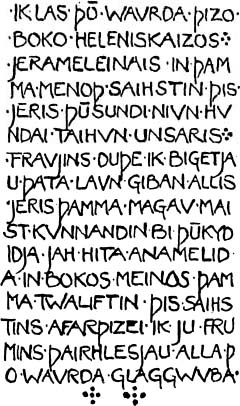

# Tolkien's Gothic Inscription in His Copy of Graves' Fifth Book of Thucydides

In his final year of school, Tolkien wrote an inscription **in Gothic** in his copy of Graves' _Fifth Book of Thucydides_.

**Letter 272** is Tolkien's response to Zillah Sherring who had purchased the book from a second-hand bookshop in Wiltshire, had noticed Tolkien's name, and had written to him with a transcription of the Gothic inscription (shown here):

Here is my transcription and interlinear gloss along with some explanations and Tolkien's own translation and comments from Letter 272.

> IK LAS ÞŌ WAVRDA ÞIZO BOKO HELENIKSAIZOS JERAMELEINAIS

`I.NOM.SG gather.PRET.1SG this.ACC.PL word.ACC.PL this.GEN.PL book.GEN.PL Greek.GEN.SG year-writing.GEN.SG`

**las** (`I gathered`) is used to mean ‘read’ by analogy with other Germanic languages.

Note **ÞIZO BOKO** (`GEN.PL`) was probably meant to be **ÞIZŌS BŌKŌS** (`GEN.SG`) (per Tolkien's letter)

I believe **JERAMELEINAIS** is a coinage of Tolkien's:

**jēr** = `year`;
**mēljan** = `to write`;
**-ein-** = abstract noun from weak verb;
**-áis** `GEN.SG`

**HELENIKSAIZOS** might be too.

‘I read the words of this book of Greek history’

> IN ÞAMMA MENOÞ SAIHSTIN ÞIS JERIS ÞŪSUNDI NIVN HVNDAI TAIHVN UNSARIS FRAUJINS

**HVNDAI** should be **HVNDA** (per Tolkien's letter)

`in this.DAT.SG month.DAT.SG sixth.DAT.SG this.GEN.SG year.GEN.SG thousand nine hundred ten our.GEN.SG Lord.GEN.SG`

‘in the sixth month of this year: thousand, nine hundreds, ten, of our Lord’

> DUÞE IK BIGETJAU ÞATA LAVN GIBAN ALLIS JERIS ÞAMMA MAGAV MAIST KVNNANDIN BI ÞŪKYDIDJA

`so.that I.NOM.SG meet-with.PRET.SUBJ.1SG this.ACC.SG reward.ACC.SG give.? every.GEN.SG year.GEN.SG this.DAT.SG boy.DAT.SG most know.PRES.PART.DAT.SG about Thucydides.DAT.SG`

‘in order to gain the prize given every year to the boy knowing most about Thucydides’

> JAH HITA ANAMELIDA IN BOKOS MEINOS ÞAMMA TWALIFTIN ÞIS SAIHSTINS AFARÞIZEI IK JU FRUMINS ÞAIRHLESJAU ALLA ÞO WAVRDA GLAGGWVBA

**FRUMINS** is probably an error for **FRUMIST** (per Tolkien's letter)

`and this.ACC.SG down-write.PRET.1SG in book.ACC.PL my.ACC.PL this.DAT.SG twelfth.DAT.SG this.GEN.SG sixth.GEN.SG after-which.GEN.SG I.NOM.SG already first* through-read.PRET.SUBJ.1SG all this.ACC.PL word.ACC.PL carefully`

**BOKOS MEINOS** (`ACC.PL`) is probaby an error for **BOKA MEINA** (`ACC.SG`) (per Tolkien's letter)

‘and this I inscribed in my books on the twelfth of the sixth (month) after I had already ? first read through all the words carefully.’

